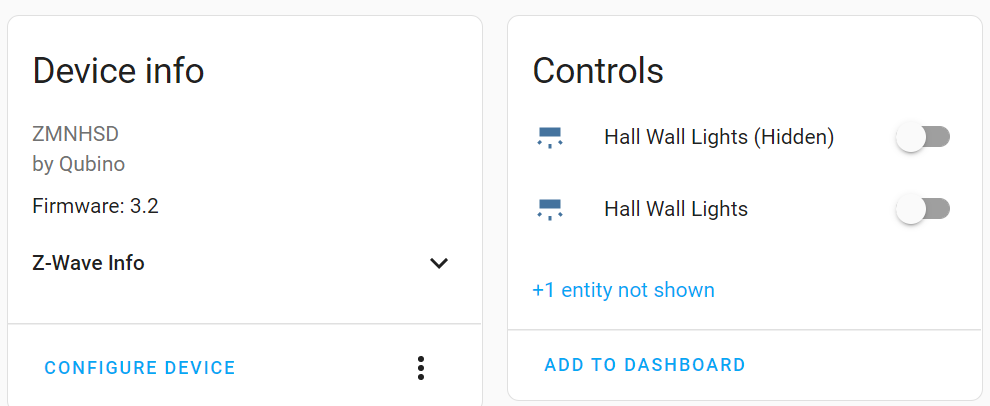
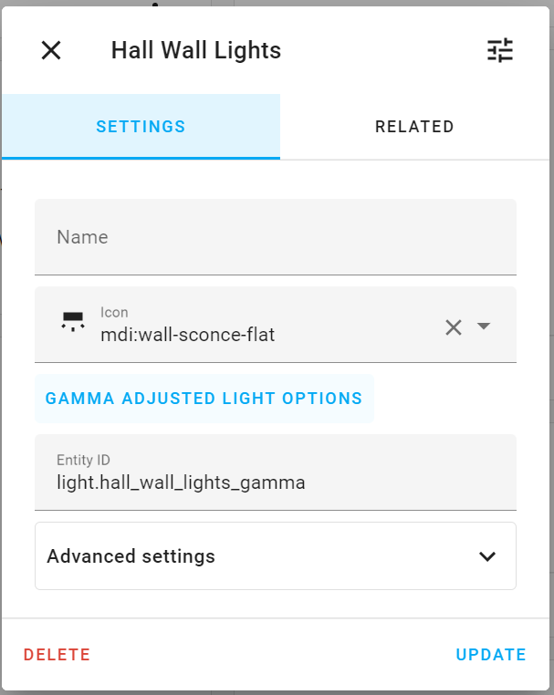
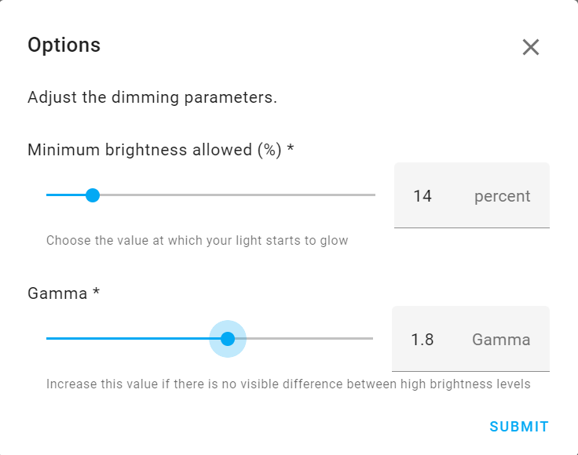

# Gamma Adjusted Light Wrapper for Home Assistant

If you, like me, have dimmers attached to dimmable fittings, or cheap IOT dimmable bulbs, you might very well find that the dimmers have a range below which the fittings do not illuminate. Wouldn't it be nice if you could tell Home Assistant to map the selected brightness value into the range which the lights actually glow?

You might also find that when you choose, for example 80% brightness, the fitting looks exactly the same brightness as 100%, and most of the visible range of dimming happens between 0% and 60%. Wouldn't it be nice if you could tell Home Assistant to map the selected brightness value so the range of input values _appears_ as a more linear brightness output?

If you answered yes to either of the above questions, maybe this integration is for you...

## What it does

Similar to the "Switch as X" feature, the integration adds a Helper, which allows you to wrap any dimmable light entity in Home Assistant, and specify the minimum dimming value of the underlying entity, and a Gamma value to adjust the brightness ramp.

The original wrapped entity is hidden, and the wrapper is added to the device that the light came from.

When you set the brightness on the light wrapper, it is adjusted into the usable range of the underlying light, according to the configured minimum brightness and gamma value. This is then passed down to the real light.

Colour, Temperature, etc. features are all passed through without modification.

## How it works

Similar to the way the Group and Switch as X helpers work, a wrapper entity is created which monitors the status of the wrapped entity.

When the wrapper is asked to turn on the light, it adjusts the brightness level required, and asks the wrapped light to turn on. When the status of the wrapped light changes, we do the inverse conversion to reflect the correct dimming state in the wrapper.

The features of the wrapper are adjusted to match the capabilities of the underlying light. Colour is always converted to the XY or COLOR_TEMP formats, and is converted back to the underlying supported format of the wrapped light by HA.

# How to use it

In the Helpers page, choose Add New Helper, and select "Gamma Adjusted Light" from the list.

Choose the light entity you want to adjust, and enter the minimum dimming value and gamma value. A Gamma of 1 will leave a linear mapping. The higher the gamma value, the more compressed the high values of the light range will be. Don't set this too high.

You can adjust the minimums and gamma values with the options dialog.

# Deleting

If you delete the helper, it will restore the hidden light entity back to normal. 

It would be advisible to do this before removing the custom component, or you may get stuck with a programatically hidden entity that can't easily be un-hidden.
